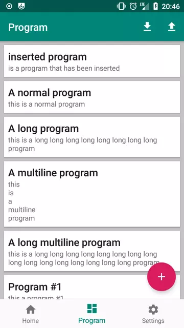
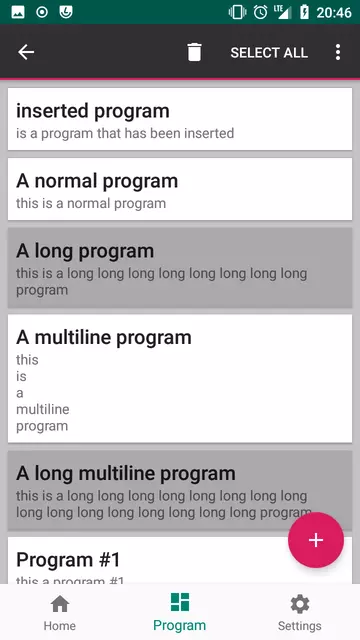
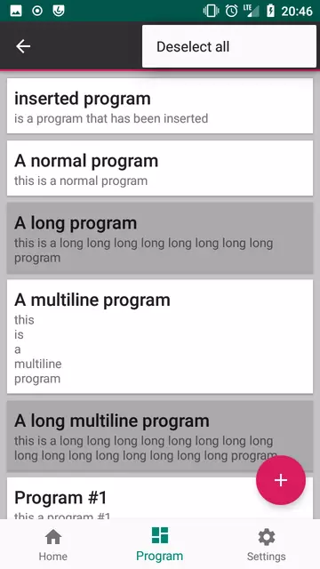
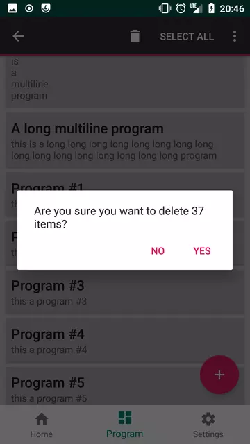

# FOSSbot
A remote robot control application for Android.

[Autogenerated documentation](https://binyot.github.io/FOSSbot/docs/app)

## Usage

### Home screen

TODO

### Program screen

There executable programs can be created, edited, 
uploaded to and downloaded from the robot.

---

Program list supports selection with Action Mode:

Selection mode | Action Bar menu expansion
:---:|:---:
 | 

---

Some actions prompt for confirmation:

### Settings screen

TODO
